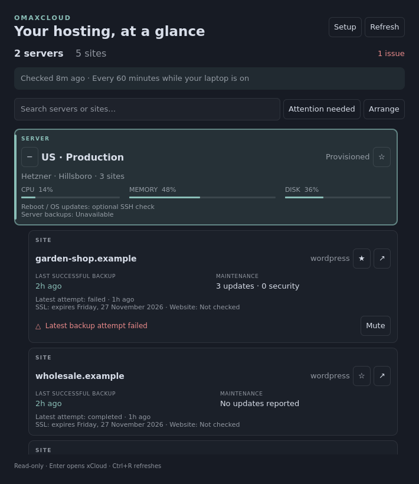

# OmaXCloud

A native Omarchy Quattro bar plugin for xCloud. Two servers or ten sites: see what needs attention, then open the right xCloud dashboard in one click.



**Version 0.2.0.** Targets Omarchy's Quattro / Quickshell plugin system, not the older Waybar desktop. Collector tests use the published xCloud OpenAPI examples. The actual dashboard was rendered and exercised offscreen with Qt 6.11. It has not yet been tested with a personal xCloud account or inside a live Omarchy desktop.

## Install

In your Omarchy terminal:

```bash
omarchy plugin add https://github.com/PatrikHallgren/omaxcloud --enable
```

Click the cloud icon, then **Setup**. A terminal asks for your API token with input hidden. In [xCloud's API token settings](https://app.xcloud.host/user/api-tokens), create a token with **`read:servers` and `read:sites` only**. Setup saves it locally with mode `600` and checks the connection. Never paste the token into GitHub or a support issue.

Requires Python 3.10+ (no Python packages), Omarchy Quattro with `omarchy plugin`, and an xCloud account with API access. `notify-send` enables desktop notifications; `ssh` is only needed for optional OS checks. Setup uses the normal Omarchy terminal launcher.

If you prefer running setup yourself:

```bash
python3 ~/.config/omarchy/plugins/patrikhallgren.omaxcloud/collector.py setup
```

If the icon has not updated after setup, click **Refresh**. Automatic local checks pick up the new cache within a minute.

## What it shows

| Level | Information |
| --- | --- |
| Bar | Cloud icon, number of reported issues, or `?` when data is unavailable |
| Server | xCloud state, provider, location, CPU/RAM/disk usage and source sample age, required service failures |
| Site | Deployment state, type, most recent successful backup and latest attempt separately, SSL expiry |
| WordPress | Pending core/plugin/theme update total and security update count; old or missing scan data is explicitly flagged |
| Optional | Public HTTPS availability from your laptop; OS updates and reboot flag through read-only SSH |

Click a **server or site name** to open its management page on xCloud. The **↗** button opens the public website. Your browser's existing xCloud login is used; the API token is never put in a link. Click **☆** to pin favorites within their group and **− / +** to collapse or expand a server. Preferences persist locally. Server cards now have a stronger accent border, a colored rail, and a SERVER label; site cards are inset and labeled SITE.

### Mute an issue for one site

Click **Mute** next to a site's issue. It immediately disappears from the active issue list, bar count, and Attention needed filter, and stops contributing to desktop notifications. Other sites are unaffected. This only changes alerting; it does not stop collecting data or change anything on xCloud.

Click **Muted alerts (n)** on that site, then **Unmute** to turn it back on. Saved mutes remain accessible even when an issue is no longer being reported. Missing, failed, and overdue backups have separate switches: muting “No successful site backup” does not suppress a future failed-backup alert. Unavailable-check messages can also be muted individually. A muted site remains visible in the normal view, with its actual backup/status details intact.

### Reorder servers and sites

Click **Arrange**, use **↑ / ↓** on a server or site, then **Done**. Servers move with their sites; sites stay inside their current server. The chosen order is saved separately for the server list and each server's sites. Manual order takes precedence over favorites. Newly discovered resources append after explicitly ordered entries. `Alt+Up/Down` moves a selected result too. Expand a server to reorder its sites.

Search keeps matching sites grouped under their server. **Attention needed** includes reported issues and unavailable checks. `Ctrl+F` focuses search, `Down` moves into results, arrows or `j/k` navigate, `Enter` opens the selected xCloud page, `Left/Right` collapse/expand a selected server, `f` pins it, `Ctrl+R` refreshes, and `Esc` closes (or first clears search). Buttons are also keyboard focusable with Tab.

## Hourly while your laptop is on

The plugin performs a cheap local due check every minute and collects from xCloud **once per hour by default**, plus manual refreshes. After suspend, the next local tick refreshes if overdue. No always-on server, background daemon, or system service is installed. Disabling/removing the widget stops collection.

Requests are sequential and spaced at least 1.1 seconds apart to stay below xCloud's documented 60 requests/minute limit. A full refresh can take roughly a minute for ten sites, longer with many backup pages. The UI stays responsive and retains its previous snapshot until the new one is ready. A shared file lock avoids duplicate collection on multiple monitors. `429` responses stop further API requests during the supplied cooldown; API/network failures retry after five minutes. Unsupported optional checks retry on the normal hourly interval.

If a refresh fails completely, the last successful snapshot remains visible with its original time and an error banner. Missing fields never imply healthy status. Provisioned/deployed means xCloud's management state, not independently verified website uptime.

Notifications are sent only when observed issues appear or resolve. Unchanged issues are quiet; incomplete results or changed resource inventories cannot announce a recovery. Collection only runs while the widget is loaded.

## Settings

After setup, edit `~/.config/omaxcloud/config.json`. With XDG overrides, it is under `$XDG_CONFIG_HOME/omaxcloud/`. Click Refresh after changing settings.

```json
{
  "interval_minutes": 60,
  "backup_max_age_hours": 36,
  "ssl_warning_days": 14,
  "notifications": true,
  "http_checks": false,
  "team_id": "",
  "ssh_hosts": {},
  "site_options": {}
}
```

- **Backup age:** Default assumes daily backups plus a 12-hour allowance. Customize it to match each site's schedule.
- **HTTP checks:** Opt-in, public HTTPS only, no cookies/authentication, no redirect following or body downloads. Redirects are displayed as HTTP 3xx, not falsely described as a verified destination. A failure reflects reachability from your laptop, not a global outage. Non-public addresses are skipped. Keep this off for private sites.
- **Team:** Empty uses the API token's default team. Set a granted team UUID if needed. Permission errors remain visible.
- **Per-site options:** Map site UUIDs to `backup_max_age_hours` and/or `backup_mode` (`standard`, `docker`, or `off`). One-click apps use Docker backups by default; explicit `is_backup_supported: false` is honored for standard backups. Use `docker` for other Docker-backed sites. A 422 response means the endpoint does not support that resource and is shown as unavailable.

Example, inside `site_options`:

```json
{
  "YOUR-SITE-UUID": {"backup_max_age_hours": 180, "backup_mode": "standard"}
}
```

## Optional reboot and OS update checks

The published xCloud API schema does **not** expose a server's reboot-required flag, general OS package update count, or full-server backup history. OmaXCloud labels these limitations explicitly. Site backups are never presented as server backups. Non-WordPress application update inventories are also unavailable through this integration.

To enable reboot and OS updates, configure an SSH alias that already works from your laptop using a key and a verified host key. It can use your existing SSH config, including a Tailscale address. Then put the server UUID and SSH alias in `ssh_hosts`:

```json
{
  "YOUR-SERVER-UUID": "my-xcloud-server"
}
```

The fixed probe runs `python3` over SSH, reads `/var/run/reboot-required`, and counts upgradable packages using the existing Python `apt` module. It uses `BatchMode=yes` and `StrictHostKeyChecking=yes`, and never runs sudo, installs anything, refreshes package metadata, restarts services, or reboots. A host with no Python `apt` module still reports its reboot flag but has an unavailable update count.

The update count reflects the **server's existing package cache**. The panel shows the last successful apt refresh stamp when available; it does not claim that an old cache proves the OS is current. Full-server backups remain unavailable.

## Local files and troubleshooting

| File | Purpose |
| --- | --- |
| `~/.config/omaxcloud/token` | Private read-only API token, mode 600 |
| `~/.config/omaxcloud/config.json` | Collection settings |
| `~/.config/omaxcloud/ui-state.json` | Favorites, collapsed groups, per-site muted alerts, server/site ordering |
| `~/.cache/omaxcloud/snapshot.json` | Last snapshot; includes server names, sites and statuses |

The cache respects `$XDG_CACHE_HOME`. Written files use mode 600. No runtime files belong in the repository. Only the token is used as an API credential; SSH uses your local SSH configuration. No telemetry or third-party service is involved.

- **401 / rejected token:** Run Setup again.
- **403 / unavailable:** Verify token scopes and team permissions. Some resources/features may be unavailable for your account or site type.
- **SSL unavailable:** There may be no certificate record in xCloud (for example, TLS is managed elsewhere). This is unknown, not an automatic outage.
- **Old WordPress scan:** The plugin reads xCloud's existing scan; it never triggers a write operation to refresh it.
- **Metrics missing:** v0.2 normalizes numeric strings, percent strings, `ram_usage`, and explicitly named nested percentage fields. If the latest endpoint lacks a metric, it tries the latest dated sample from the documented history endpoint. History can require an xCloud Pro plan. History-derived values show their sample age; missing values show N/A with an explanation, never an invented zero. If values remain unavailable, run the following and share its output (response field names/types only, not your token, server names or UUIDs):

  ```bash
  python3 ~/.config/omarchy/plugins/patrikhallgren.omaxcloud/collector.py diagnose-metrics
  ```

- **Blank or missing widget:** Verify `omarchy plugin list`, Python 3.10+, and a recent Quattro version. Capture shell errors without including your token.
- **Inspect locally:** `python3 ~/.config/omarchy/plugins/patrikhallgren.omaxcloud/collector.py refresh` prints a sanitized status snapshot, but its domains/server names may still be private.

Update with `omarchy plugin update patrikhallgren.omaxcloud`, then click Refresh. Your token and local preferences are preserved. Remove with `omarchy plugin remove patrikhallgren.omaxcloud`. Removal leaves your separate local settings/cache intact; remove those directories yourself if you also want to erase credentials and history, and revoke the token in xCloud.

## Development and validation

```bash
python3 -m unittest discover -s tests -v
omarchy plugin validate .
```

Optional UI render and interaction smoke test (development dependency only):

```bash
python3 -m venv /tmp/omaxcloud-preview
/tmp/omaxcloud-preview/bin/pip install PySide6-Essentials
/tmp/omaxcloud-preview/bin/python tests/preview.py
```

This renders the actual `Dashboard.qml` with synthetic data and verifies search, attention filtering, collapse, per-site mute/unmute counts, and server/site ordering. It does not simulate the full Omarchy compositor or authenticate with xCloud. The preview image is illustrative, not account data.

Reference contracts checked: [xCloud OpenAPI](https://app.xcloud.host/api/v1/openapi.json), [Omarchy shell plugin guide](https://github.com/omacom/omarchy/blob/quattro/manual/32-shell-plugins.md), and upstream Omarchy commit `a85e29abb556816f4644cf975e98da694b486aa8`. See [API coverage](docs/API.md) for endpoint details.
